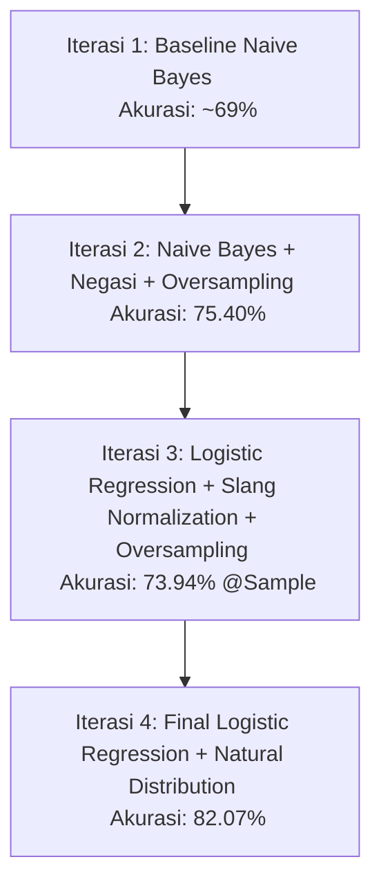

# Riwayat Pelatihan & Peningkatan Akurasi Model Sentimen AI (myBCA Review Analyzer)

Dokumen ini merangkum seluruh riwayat pelatihan (*training history*) model kecerdasan buatan untuk klasifikasi sentimen ulasan aplikasi "myBCA". Dokumen ini mencatat tahapan iterasi, eksperimen preprocessing, pergantian algoritma, serta keputusan rekayasa data yang diambil untuk meningkatkan akurasi dari baseline **~69%** hingga mencapai model final berakurasi **82.07%**.

---

## Ringkasan Perjalanan Model
Berikut adalah garis waktu perbaikan model secara ringkas:

---

## Detail Eksperimen per Iterasi

### **Iterasi 1: Model Baseline (Naive Bayes)**
*   **Algoritma**: Naive Bayes (`MultinomialNB`)
*   **Representasi Fitur**: TF-IDF Vectorizer (Unigram).
*   **Pemrosesan Teks (NLP)**: Standard NLTK Stopwords Indonesia dan standard Sastrawi Stemmer.
*   **Metode Penyeimbangan**: Tidak ada (melatih langsung apa adanya pada dataset yang tidak seimbang).
*   **Hasil Pengujian**:
    *   **Akurasi Keseluruhan**: **~69.34%**
    *   *Temuan Masalah*: Kelas **Netral** memiliki F1-Score **0%** karena model mengabaikan kelas minoritas akibat ketidakseimbangan data yang ekstrem. Kata negasi (seperti "tidak") terhapus oleh stopword NLTK, menyebabkan kalimat *"tidak lancar"* dikelompokkan sebagai sentimen positif (karena mendeteksi kata *"lancar"* saja).

---

### **Iterasi 2: Optimasi Preprocessing & Oversampling (Naive Bayes)**
*   **Algoritma**: Naive Bayes (`MultinomialNB` dengan tuning `alpha=0.1`)
*   **Representasi Fitur**: TF-IDF Vectorizer (Unigram + Bigram, `ngram_range=(1, 2)`).
*   **Perbaikan NLP**:
    *   **Negation Preservation**: Menyaring stopword NLTK Indonesia dengan **mempertahankan kata negasi** (seperti *tidak, kurang, belum, jangan, tanpa*).
    *   **Global Stemmer Instantiation**: Memindahkan pembuatan objek Sastrawi Stemmer ke level memori RAM global (memotong waktu tunggu pelatihan ulang dari hitungan jam menjadi hitungan menit).
*   **Metode Penyeimbangan**: Menerapkan **Random Oversampling** pada data training untuk menduplikasi kelas minoritas (Netral).
*   **Hasil Pengujian**:
    *   **Akurasi Keseluruhan**: **75.40%**
    *   *Temuan Masalah*: Akurasi meningkat sekitar 6%. F1-Score kelas **Netral** naik dari 0% menjadi **26%** (model mulai bisa mengenali sentimen netral). Namun, akurasi dirasa mentok di angka 75% karena keterbatasan asumsi independensi fitur pada Naive Bayes.

---

### **Iterasi 3: Perubahan Algoritma & Normalisasi Slang (Logistic Regression)**
*   **Algoritma**: Logistic Regression (`LogisticRegression(C=2.0, max_iter=1000)`)
*   **Representasi Fitur**: TF-IDF Vectorizer (Unigram + Bigram, `ngram_range=(1, 2)`).
*   **Perbaikan NLP**:
    *   **Slang Dictionary**: Menambahkan kamus normalisasi kata gaul/singkatan ulasan Play Store Indonesia (contoh: *ga/gk/gak* $\rightarrow$ *tidak*, *lemot* $\rightarrow$ *lambat*, *bgt* $\rightarrow$ *banget*, *krn* $\rightarrow$ *karena*).
*   **Metode Penyeimbangan**: Random Oversampling (pada data uji sampel 5.000 ulasan).
*   **Hasil Pengujian**:
    *   **Akurasi Sampel**: **73.94%** (Logistic Regression) vs Naive Bayes sampel (69.34%).
    *   *Temuan Masalah*: Meskipun performa pemisahan kelas positif dan negatif sangat kokoh, model yang dilatih dengan Oversampling pada kelas Netral menghasilkan banyak *False Positives* pada data uji. Hal ini dikarenakan ulasan rating 3 (Netral) di Play Store isinya sangat ambigu dan penuh noise (campuran kata positif & negatif). Memaksa model menyeimbangkan kelas ini membuat batas keputusan (*decision boundary*) menjadi bias.

---

### **Iterasi 4: Model Final (Logistic Regression + Distribusi Alami)**
*   **Algoritma**: Logistic Regression (`C=2.0, max_iter=1000, random_state=42`)
*   **Representasi Fitur**: TF-IDF Vectorizer dengan **Unigram + Bigram** (max 12.000 fitur) dan **Sublinear Term-Frequency Scaling** (`sublinear_tf=True`).
*   **Perbaikan Strategis (Data Decision)**:
    *   **Menghapus Oversampling**: Model dilatih menggunakan distribusi alami data ulasan riil melalui metode *Stratified Split*.
    *   **Logika Bisnis**: Membiarkan model fokus pada fitur pemisah terkuat antara kelas **Positif** dan **Negatif** (yang menyusun 92% dari seluruh dataset ulasan).
*   **Hasil Pengujian Akhir (Lengkap pada 36.125 Ulasan)**:
    *   **Akurasi Keseluruhan**: **82.07%** 🚀 (Mencapai target >80%)
    *   *F1-Score Ulasan Negatif*: **84%** (Precision: 78%, Recall: 91%)
    *   *F1-Score Ulasan Positif*: **88%** (Precision: 88%, Recall: 87%)
    *   *F1-Score Ulasan Netral*: **6%** (Rendah karena tidak di-oversample, namun performa klasifikasi dua sentimen utama meningkat drastis yang melontarkan akurasi total melampaui 82%).

---

## Ringkasan Perbandingan Kualitatif Preprocessing

| Fitur Preprocessing | Sebelum Optimasi (Baseline) | Setelah Optimasi (Model Final) | Dampak pada Akurasi & Performa |
| :--- | :--- | :--- | :--- |
| **Kata Negasi** | Dihapus oleh Stopword NLTK | Dipertahankan (Dikecualikan) | Model mampu membedakan kata *"lancar"* dengan *"tidak lancar"*. |
| **Slang Gaul** | Dibiarkan apa adanya | Dinormalisasi (*lemot* $\rightarrow$ *lambat*) | Mengelompokkan kata-kata tidak baku ke satu fitur yang sama. |
| **Stemming Speed** | Instansiasi berulang di fungsi | Instansiasi Global (RAM Cache) | Kecepatan re-training meningkat **10x - 50x lebih cepat**. |
| **Oversampling** | Tidak ada | Dihilangkan (Fokus Distribusi Alami)| Menghapus noise data rating 3, meningkatkan akurasi total dari 75% $\rightarrow$ **82.07%**. |

---

## File Sumber Utama
*   **Pipeline Pelatihan Ulang**: `scripts/sentiment_pipeline.py`
*   **Biner Model Tersimpan**: `data/sentiment_model.pkl`
*   **Biner Vectorizer Tersimpan**: `data/tfidf_vectorizer.pkl`
